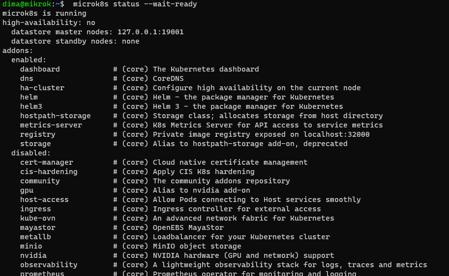
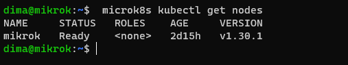
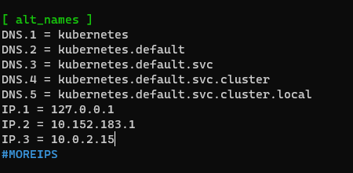
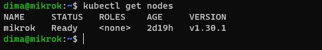
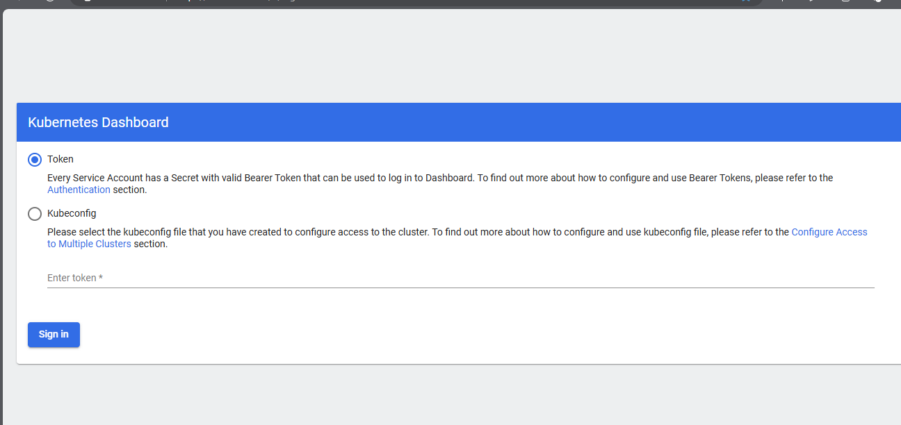
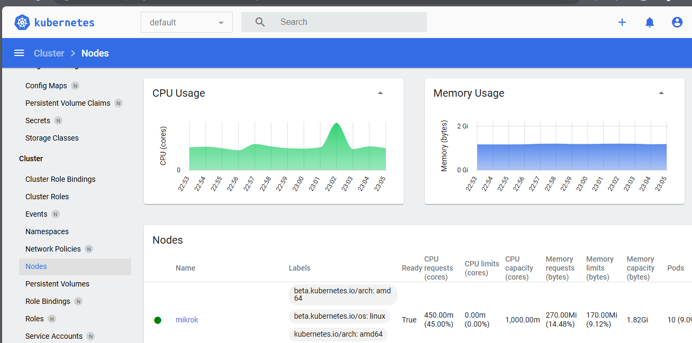

# Домашнее задание к занятию «Kubernetes. 

# Задание 1. Установка MicroK8S

 *Установить MicroK8S на локальную машину или на удалённую виртуальную машину.*
 
  *Установить dashboard.*
 

 
 
 Редактирование файла /var/snap/microk8s/current/certs/csr.conf.template
 

 
 Обновил сертификаты
 
 
# Задание 2. Установка и настройка локального kubectl

*Установить на локальную машину kubectl.*

Используя port-forward подключаюсь к Kubernetes Dashboard

